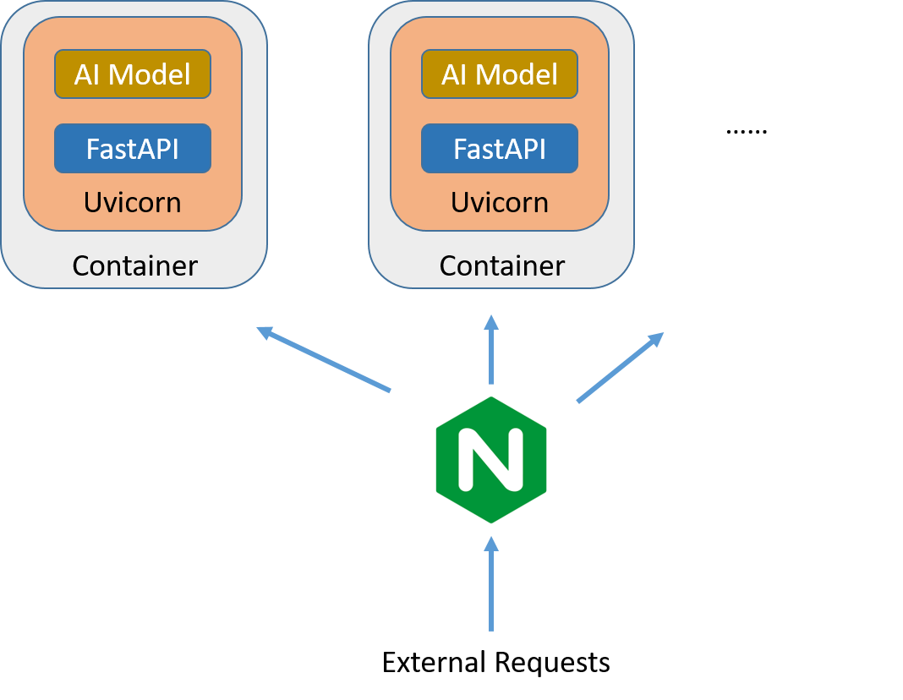

# EfficientServe-FastAPI



## Install nvidia-docker
```commandline
$> sudo apt-get update
$> sudo apt-get install -y nvidia-docker2
$> sudo systemctl restart docker
```

## Build Image
- app
    ```commandline
    $> cd dockers/app
    $> docker build -t demo_app .
    ```

## Run Service
- App
    ```commandline
    $> cd dockers/app
    $> docker compose up -d
    ```

- Nginx
    
    ```commandline
    $> cd dockers/nginx
    ```
  
    step1: edited upstream servers
    ```
    upstream ner_service {
        server <host>:<port>;  # <- change here
    }
    ```
  
    step2: run service
    ```commandline
    $> docker-compose up -d
    ```
  
## Test the performance
You can try changing `num_threads` in `stress_test.py` or adding/removing the upstream server
```
$> python stress_test.py
```